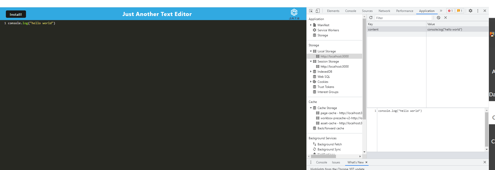

# gen-PWA19

## User Story

I WANT to create notes or code snippets with or without an internet connection
SO THAT I can reliably retrieve them for later use

## Description

My task was to build a text editor that runs in the browser.

## Screenshot

<section>
    
</section>

